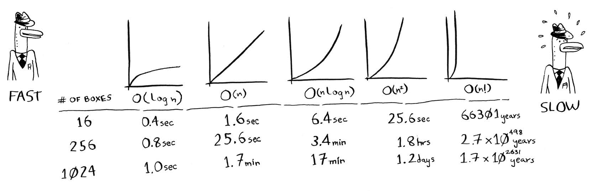

# Chapter 1 - Introduction to Algorithms
*__An algorithm__ is a set of instructions for accomplishing a task.*

- foundation of book
- search algorithm (binary search)
- running time of algorithm (Big O notation)
- designing algorithms (recursion)

## Binary Search
*__Binary search__ is an algorithm whereby its input is a sorted list of elements.*

**Binary search** is required to solve a common search problem whereby a large list of data needs to be searched but it would not be efficient to search from the start of the data list (which is known as **simple search**).

Any list of **n** will take **log(2)n** steps to run in worst case (with **binary search**), while it would take **n** steps to run with **simple search**.
> log(10)100 = 2 (*“How many 10s do we multiply together to get 100?”*) - essentially *the flip of exponentials*

### Extra Definitions
**Running Time**: *Represents how long it takes for algorithm to complete (both time and/or space).*
    - **simple search** => *linear time*
    - **binary search** => *log(arithmic) time*

**Big O Notation**: *A special notation that tells you how fast an algorithm is.*
    - lets you compare the number of operations:
        - O(n)      [simple search]
        - O(log n)  [binary search]
    - common Big O's:
        - **Log Time**: *O(log n)*
        - **Linear Time**: *O(n)*
        - **Fast Sorting**: *O(n * log n)*
        - **Slow Sorting**: *O(n2)*
        - **Slowest Sorting** *O(n!)*

### Exercises
#### 1.1
7 Steps

#### 1.2
8 Steps