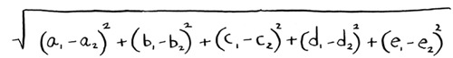

# K-Nearest Neighbors (KNN)
An algorithm that determines what something is through looking at the nearest neighbors and seeing mode.

We must determine *features* and compare these through a graph before the nearest neighbors can be determined (Pythagorean formula can be used):

Picking the right *features* to compare:
- features that don't correlate to the items that you are trying to recommend
- features that can't have bias

## Regression
Taking the average of ratings allows prediction of responses:
- **classification**: categorization into a group
- **regression**: predicting a response

## Cosine Similarity
Instead of measuring the distance between two vectors, it compares the angles of the two vectors (good for various ratings).

## Machine Learning Basics
Essentially boilds down to making the computer more intelligent.

### OCR
**Opitmal character recognition**; computer can read text from photos, using KNN:
1. go through many images of numbers, extracting features of these numbers (also known as **training**)
2. extract features of target image and see nearest neighbors in graph from step 1

### Spam Filters
Most spam filters using an algorithm called **Naive Bayes classifier**:
- check how common each word is from an email in a spam email

## Exercises
Q10.1
The larger the sample size, the greater anomalies such as this will be incorperated.

---
Q10.2
You could put more weight on the people falling under the 'influencers' catagory.

---
Q10.3
Too low
